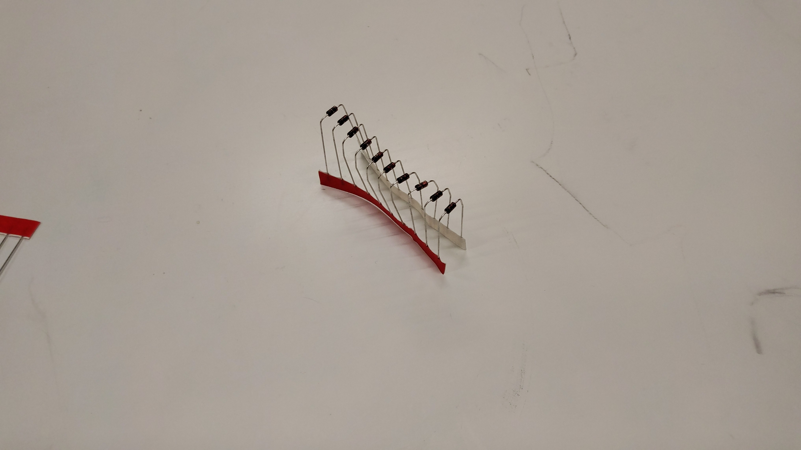
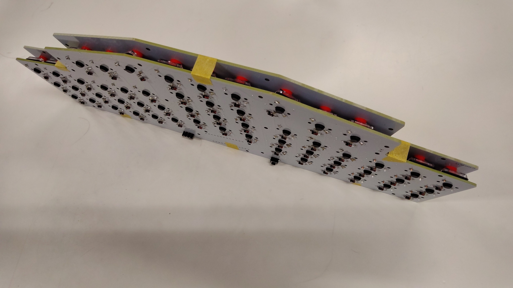

# はじめに
キットをご購入いただいた方、お買い上げありがとうございます。 
初めてのキーボード設計、初めてのキット化なので、至らぬ点があると思います。 
不備やわからないことがあれば遠慮なくお問い合わせください。 

## 注意事項
本キットはご購入者様がご自分で組み立てるキットです。 
できる限り簡単に組み立てられるように設計しておりますが、必ず組み立てる前にこのビルドガイドを熟読してください。
疑問点があれば、必ず組み立てる前に設計者まで問い合わせてください。取り返しのつかないミスをする前に確認することが大事です。 

# キット内容物一覧（2023年の大学祭で頒布したバージョン）

|    |    |
| ---- | ---- |
|  PCB  |  1枚  |
|  ボトムプレート  |  1枚  |
|  トッププレート（ロゴあり）  |  1枚  |
|  トッププレート（ロゴ無し）  |  1枚  |
|  Pro Micro  |  1個  |
|  コンスルー  |  2個  |
|  ダイオード  |  60個  |
|  ネジ  |  32個  |
|  4mmスペーサー  |  14個  |
|  7mmスペーサー  |  4個  |
|  リセットスイッチ  |  1個  |
|  スライドスイッチ  |  1個  |
|  ゴム足  |  6個  |

万が一部品が不足している場合、メールやTwitterのDMにメッセージいただけましたらすぐに発送対応いたします。

# キット以外で必要なもの

|    |    |
| ---- | ---- |
|  キースイッチ（Kailh Choc v1 or v2）  |  54個  |
|  キーキャップ（Choc v1 or v2用キーキャップ）  |  54個  |
|  USBケーブル（Pro microとPCを接続するもの）  |  1本  |

## キースイッチ
ErgoGridGoはロープロファイル（背の低い）スイッチであるKailh Choc v1スイッチまたはKailh Choc v2スイッチに対応しています。54個必要です。
v1とv2でキーキャップの軸の形状が異なるので、よくご確認の上でご購入ください。

https://shop.yushakobo.jp/products/pg1350
https://shop.yushakobo.jp/products/kailh-choc-v2

## キーキャップ
#### 再三記載しますが、Choc v1とChoc v2ではキーキャップの軸の形状が異なります。調達前によくご確認してください。
ErgoGridGoはすべてのキーが一番小さい単位の1uというサイズのキーで構成されるため、一般的なキーキャップセットでは印字を一致させることは出来ません。キーキャップセットで足りないところを無刻印のキーキャップで補うと良いかもしれません。
※Choc v2スイッチはMXキーキャップを取付できますが、一部のキーキャップと干渉し上手くはまらない可能性があります。

# 必要な工具一覧

## 必須

- はんだごて
- 精密ドライバー
- やすり
- ピンセット

## あると便利

- ダイオードベンダー
- マスキングテープ
- 輪ゴム

# 組み立て

本キットには部品の取り付け順序があります。十分注意してください。

## PCB、トッププレートのバリを削り落とす

PCBやトッププレートには、製造の都合上バリ（太さ2mm程度の突起）が残っている場合があります。
やすり等で削り落としてください。その際、PCB表面の配線を傷つけないよう気をつけてください。

## タクトスイッチをはんだ付けする

PCBの裏面、「RESET」と書かれた位置に差し込み表面からはんだ付けします。

## 基板にコンスルーを差し込む

Pro microを使用する場合は、「Bat+」と「Bat-」を避けるように差し込みます。

ただし、コンスルーには向きがあります。

金色の部分が片方の面から両方見える様に、また金色の部分がPro Micro側に寄っている様に取り付けます。

誤った向きに取り付けると、修正するのは極めて難しいです。不安な場合は、必ず有識者に問い合わせください。

## Pro microにコンスルーをはんだ付けする

#### はんだ付けするのはコンスルーとPro microだけです。コンスルーとPCBは着脱できるように、はんだ付けしないでください。

はんだ付けのコツは、接着する箇所を適正温度まで温めることです。まずこての先端を2秒程度あててピンとスルーホールを加熱し、それからはんだを付け、溶けたはんだが適度に流れ込むまで1秒程度、こてを当ててから離します。2秒温め、2回はんだを差し、1秒待ってこてを離す。これが目安です。

## Pro Microの書き込み

以下のRemapのページをクリックして、ファームウェア書き込みページを開きます。
https://remap-keys.app/catalog/hUqBCgGUT5qS4GSuLbLD/firmware

「ergogridgo_promicro_v1」の「FLASH」をクリックします。

通常のProMicroは「caterina」を選択してから「FLASH」をクリックします。

先ほどはんだ付けしたリセットスイッチを押します。

右上に表示されたポップアップから、Pro microを選択してください。

ファームウェアの書き込みが完了したらメッセージの最後に「successfully」が表示されます。

Pro Microに書き込んだらRemapからキーマップが書き換え可能になります。

## Pro Microを一旦抜く

この後の工程の邪魔になるので、一度Pro microを取り外します。コンスルーピンを曲げないようにご注意ください。

## ダイオードをはんだ付けする（リードタイプの場合）

### ダイオードの足を曲げる

ダイオードを差し込む間隔に合わせてまず足を曲げます。ダイオードベンダーがあると便利です。

### ダイオードの向きを揃えて挿入する

足を曲げたら台紙から切り離し、穴に差し込んでいきます。

#### ダイオードには向きがあります。逆向きに取り付けるとそのキーは反応しません。

基板に書かれている向き（ダイオードのラインと基板上の記号「▷|」の縦のラインを合わせる）に合わせて差し込んでいきます。
白基盤の場合は、ダイオードの黒い塗装がダイオードのアイコンの黒塗りの部分と重なるような向きです。
黒基盤の場合は、白塗りの部分と重ねましょう。

基板をひっくり返しても落ちない用にマスキングテープで止めるか足を広げておきます。

### はんだ付け

ダイオード全てのはんだ付けが終わっているかよくご確認ください。
確認後、ダイオードの足をギリギリで切ってください。

## キースイッチをはんだ付けする

いよいよキースイッチを付けます。PCBの表面から、キースイッチ（Choc v1 or v2）を差し込みはんだ付けします。

キースイッチが安定しない場合は、画像のようにマスキングテープとボトムプレートを使って押さえつけると良いでしょう。

## スペーサーをネジ止めする

### トッププレート固定用のスペーサー

PCB上部、Pro micro取付位置周囲の穴3つに長いスペーサー（7mm）を取り付けます。スペーサーを表面に置き、裏からネジ止めしてください。

### ミドルプレートがある場合

ミドルプレートの六角形の穴に短いスペーサー（4mm）をはめてください。

### ボトムプレートに4mmのスペーサーを取り付ける

まずボトムプレートの表裏をご確認ください。製造番号が書いてある方が表です。
表面にスペーサーまたはスペーサーをはめたミドルプレートを置き、裏からネジ止めしてください。

## PCBとボトムプレートの接合

スペーサーを取り付けたボトムプレートの上にPCBを配置し、PCBの表側からネジ止めしてください。

## Pro microを取り付ける

外すときと同様に、コンスルーピンを曲げないようご注意ください。

## トッププレートの取り付け

PCB上部に取り付けた7mmスペーサーに、トッププレートをネジ止めしてください。

## テストする
PCに繋ぎキーの反応をテストします。

## キーマップをカスタマイズする

###  jsonファイルのダウンロード

下記リンクより、jsonファイルをダウンロードしてください。
https://github.com/JetJaguar-PSX/ErgoGridGo/blob/main/json/ergogridgo.json

### REMAPによるキーマップのカスタマイズ

PCとPro microを接続し、下記リンクよりキーマップをカスタマイズしてください。あなただけのオリジナルのキーマップを探求してください。
https://remap-keys.app/configure

## キーキャップを取り付ける
キーマップに応じた配列で、キーキャップを取り付けます。軸を折らないようにお気を付けください。

# 完成

お疲れ様でした！
なるべく組み立てやすい様に設計したつもりですが、なにかわからないことがあればご連絡ください。
